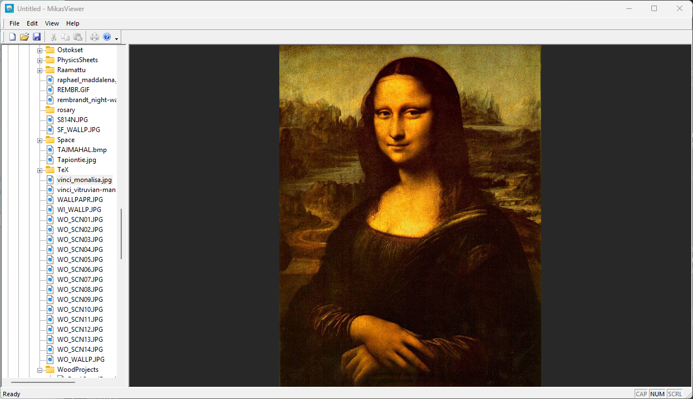

# MikasViewer

A Windows image viewer built with MFC (Microsoft Foundation Classes) and GDI+.

## Screenshot



## Features

- **Explorer-style folder tree** — Browse your file system with a familiar tree view. All logical drives are shown at the root level with their display names (e.g. "Windows (C:)") and Windows shell icons.
- **Lazy loading** — Subfolders and image files are loaded on demand when a tree node is expanded, keeping the UI fast even with large directory structures.
- **Image files in tree** — Image files (JPG, PNG, BMP, GIF, TIFF, WEBP) are shown directly in the folder tree alongside folders.
- **Centered image display** — The selected image is automatically centered in the view and scaled to fit the window (fit-to-window, max 100 %).
- **Mouse pan** — Click and drag to pan around images larger than the window.
- **Mouse wheel zoom** — Scroll to zoom in/out (±15 % per notch, range 5 %–2000 %). Zoom is anchored to the mouse cursor position.
- **Double-buffered rendering** — Flicker-free drawing with GDI+ high-quality bicubic interpolation.
- **Dark background** — Dark grey background (similar to common image viewers) for comfortable image browsing.
- **Title bar** — Shows the current image filename in the window title bar.
- **WebP support** — WebP images are loaded via Windows Imaging Component (WIC) as a fallback when GDI+ cannot decode the format.
- **Print & Print Preview** — Print the current image via **File → Print** or preview it with **File → Print Preview**. The image is automatically scaled to fill the printable area (with a 5 % margin on each side) while preserving the aspect ratio, and centered on the page.
- **Help system** — Built-in CHM help file, opened via **Help → Help Topics** or <kbd>F1</kbd>. Covers browsing, zoom/pan, supported formats, printing, and keyboard shortcuts.

## Supported Image Formats

| Extension | Format |
|-----------|--------|
| `.jpg` / `.jpeg` | JPEG |
| `.png` | PNG |
| `.bmp` | Bitmap |
| `.gif` | GIF |
| `.tif` / `.tiff` | TIFF |
| `.webp` | WebP (via WIC) |

> **WebP on Windows 10:** requires [WebP Image Extensions](https://apps.microsoft.com/detail/9pg2dk419drg) from the Microsoft Store. Built-in on Windows 11.

## Requirements

- Windows 10 or later
- Visual Studio 2022 (v143 toolset)
- MFC (included with Visual Studio "Desktop development with C++" workload)

## Building

1. Open `MikasViewer.slnx` in Visual Studio 2022.
2. Select configuration **Debug** or **Release**, platform **x64**.
3. Build → Build Solution (`Ctrl+Shift+B`).

The executable is placed in `x64\Debug\` or `x64\Release\`.

> **Help file:** After building, copy `help\MikasViewer.chm` to the same directory as the executable. To recompile the help file after editing sources, run:
> ```
> "C:\Program Files (x86)\HTML Help Workshop\hhc.exe" help\MikasViewer.hhp
> ```

## Usage

| Action | Result |
|--------|--------|
| Click a folder in the tree | Displays the first image found in that folder |
| Click an image file in the tree | Displays that image |
| Mouse wheel | Zoom in / out (anchored to cursor) |
| Left-click + drag | Pan the image |
| `Ctrl+P` | Print the current image |
| **File → Print Preview** | Preview the print output before printing |
| <kbd>F1</kbd> or **Help → Help Topics** | Open the built-in help file |

## License

MIT
